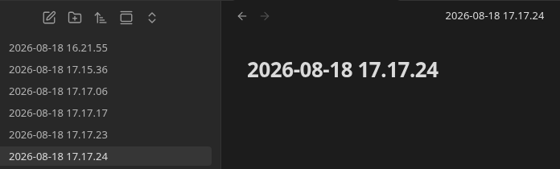
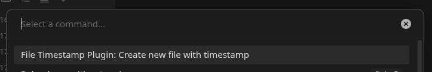

# File Timestamp Plugin for Obsidian

This Obsidian plugin adds a ribbon and a command to create a new file with current date timestamp.

This is a ribbon which when clicked creates a new file with timestamp.

The command can be assigned to a shortcut for quicker file creation.

Settings allows customizing the folder where new file with timestamp is created.

